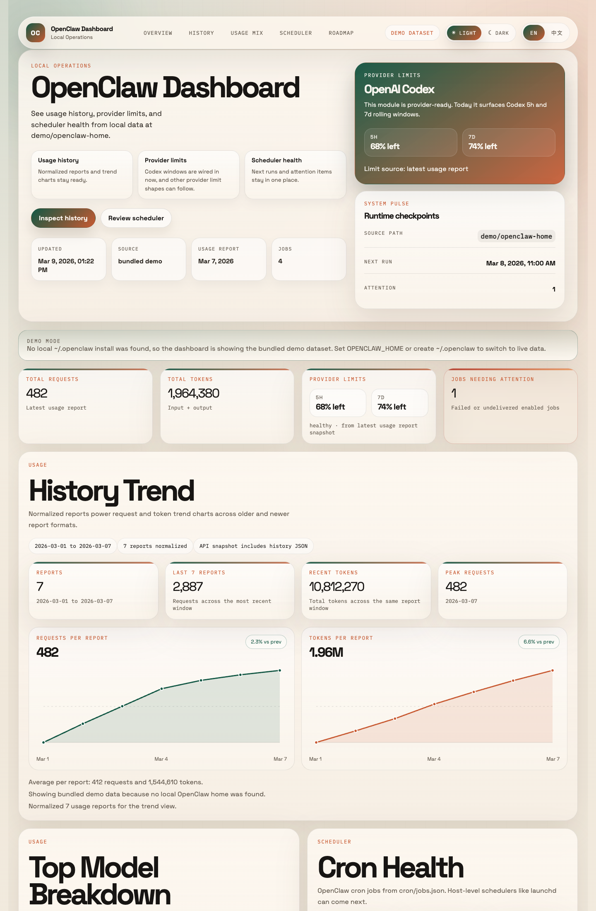
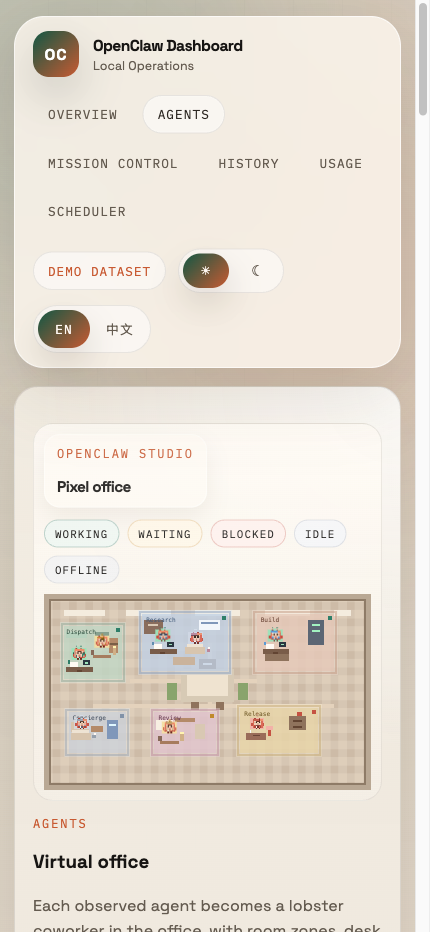
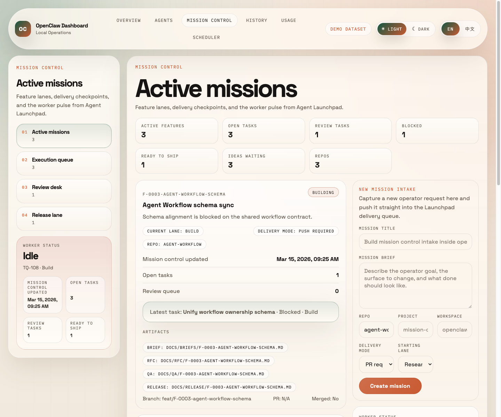
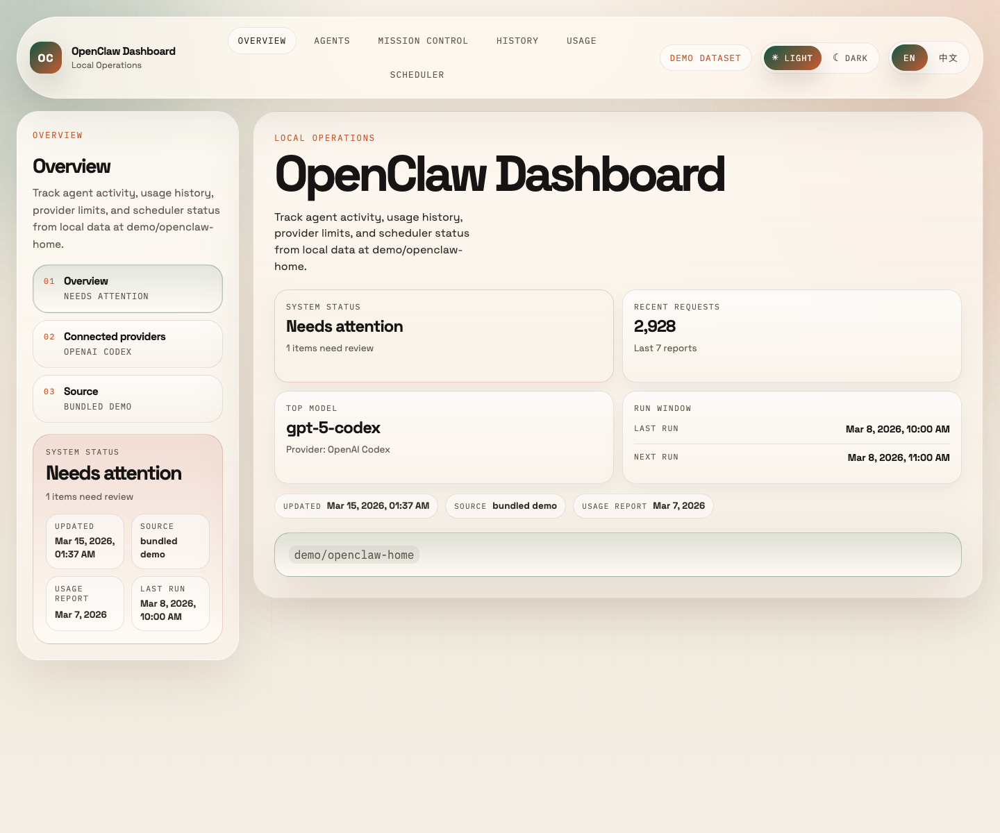
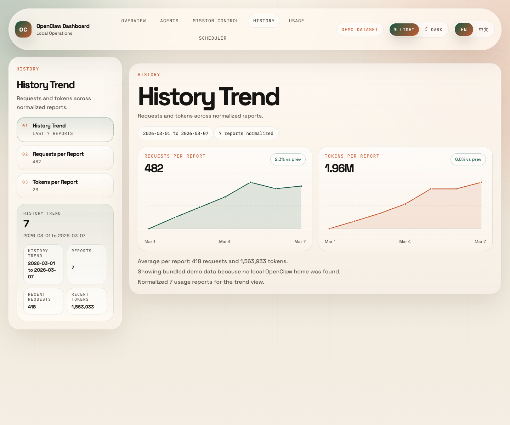
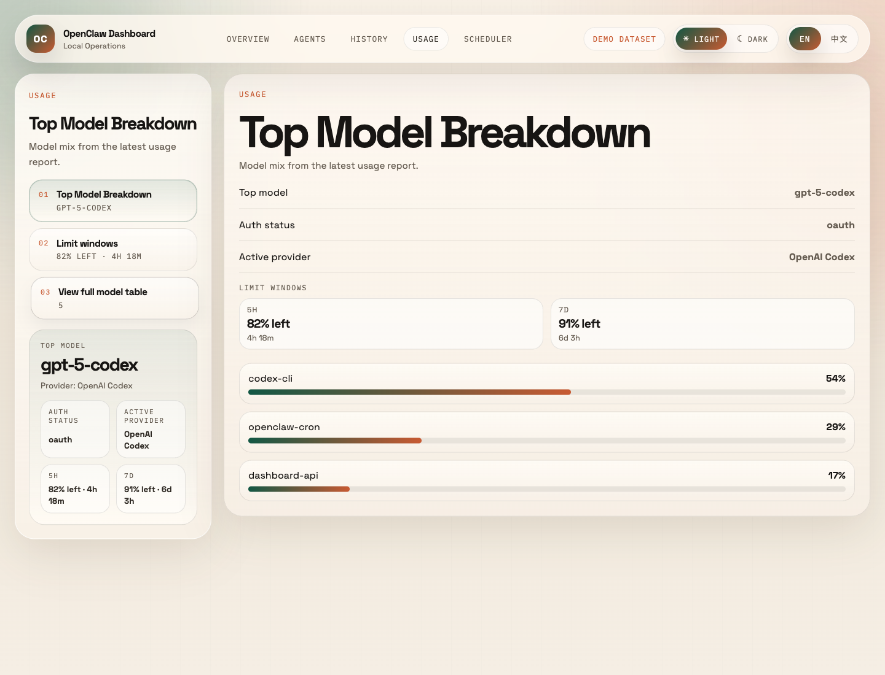
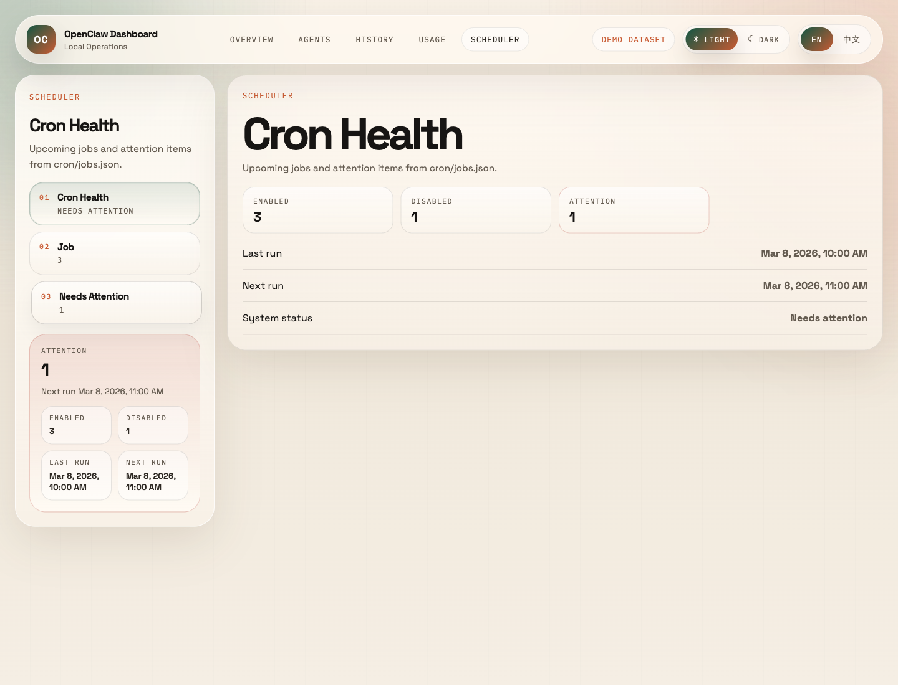

# OpenClaw Dashboard

[English](README.md) | [简体中文](README.zh-CN.md)

OpenClaw workstation with dedicated Agents, Mission Control, Overview, History, Usage, and Scheduler workspaces.

Latest release: `1.4.0 Agent Clarity`.

<p align="center">
  
  
</p>

## Other Workspaces

<p align="center">
  
</p>
<p align="center">
  
  
</p>
<p align="center">
  
  
</p>

## Features

- top-level dashboard shell with a primary menu, contextual left navigation, and single-panel rendering
- dedicated `Agents` workspace with room-based navigation, explicit mission ownership, and live Mission Control join-up
- `Virtual Office` pixel office scene for active, waiting, blocked, and idle agents
- explicit repo-work / intake provenance on working agents, including multi-session workload entries when metadata is available
- explicit `Mission Control` mapping states on working agents, labeled as exact, partial, or unavailable without moving ownership truth out of Mission Control
- advisory idle suggestions sourced from local repo plans plus personal research, with ranking reasons kept clearly non-owning
- concise coordination brief that replaces the old lower-half analytics sprawl with active workloads and likely next moves
- one-click handoff from trustworthy Agents mapping cards into the closest relevant `Mission Control` panel
- room-level mission ownership inside the office view, including inline mission queue cards that can focus the owning room
- shared room or agent detail drawer with task path, handoffs, and linked artifacts
- inline office actions for advancing, blocking, or resetting the focused Mission Control task
- a pressure rail that surfaces stale review, blocked-too-long, waiting-on-human, inferred ownership, and overloaded rooms
- lifecycle-aware operator summary that distinguishes new, sustained, slipping, and recovering pressure without hiding the live snapshot
- room and mission detail evidence that explains lifecycle judgments with recent wait/age context and safe fallback copy
- top-level `Mission Control` workspace for mission intake, queue progress, review pressure, and release readiness
- `Office Floor`, `Queues & handoffs`, and `Recent activity` panels for simplified agent operations visibility
- latest usage report summary
- connected providers with auth/profile metadata, active highlighting, and reusable limit tiles
- Codex 5h / 7d rolling limit visibility inside the active provider row
- OpenRouter API profile visibility with daily free-quota usage from AI model usage reports
- top-model source share
- model usage table
- cron overview
- next scheduled jobs
- failing or undelivered jobs list
- automatic fallback to a bundled demo dataset for public previews and first-run setup
- normalized usage history and trend charts across multiple reports

The repo is intentionally broader than a single usage report skill. The goal is a proper OpenClaw workstation that can grow into agent operations, mission control, channels, browser telemetry, delivery health, and host-level schedulers.

## How it works

The app supports separate source paths for the two live datasets:

- agents + usage + scheduler: reads from `OPENCLAW_HOME` or `~/.openclaw`
- mission control: reads from `MISSION_CONTROL_HOME` or `~/.openclaw/mission-control`
- demo mode: if either live path is missing, that surface falls back to bundled demo data
- local frontend binding: `pnpm dev` / `pnpm start` read `DASHBOARD_URL` from `.env` or `.env.local`

This makes the repo publishable as-is while still preferring real local data on machines that
already have OpenClaw installed.

By default the app reads from `~/.openclaw`. You can override that with `OPENCLAW_HOME`. If no
live install is present, the app serves bundled demo data instead.

- usage reports: `workspace/memory/usage/*.md`
- cron jobs: `cron/jobs.json`

This keeps the app centered on your own OpenClaw setup and avoids needing a custom backend yet.
The JSON snapshot is also exposed at `/api/snapshot`, including normalized `agents` data for the
office views, explicit `agents.workloads` and `agents.advisorySuggestions` coordination fields,
explicit `agents.missionMapping` handoff metadata for exact / partial / unavailable Mission Control joins,
shared `pressure` lifecycle data for operator surfaces and verification, `usage.history` data for
charts, `usage.providerLimits` for active rolling windows, and `usage.providerProfiles` for saved
provider profiles such as OpenAI Codex and OpenRouter.

## Quick Start

```bash
git clone <your-fork-or-this-repo-url>
cd openclaw-dashboard
cp .env.example .env
pnpm install
pnpm dev
```

Then open the URL from `DASHBOARD_URL` (the example config uses [http://localhost:3000](http://localhost:3000)).

Next.js will auto-load `.env` / `.env.local`, so after that first setup you can just run:

```bash
pnpm dev
```

If your OpenClaw home is not `~/.openclaw`, set it in `.env` or `.env.local`:

```bash
OPENCLAW_HOME=/path/to/.openclaw
```

`OPENCLAW_HOME=~/.openclaw` is also supported.

To move the local frontend off the default port, set this in `.env` or `.env.local`:

```bash
DASHBOARD_URL=http://localhost:3000
```

Then just run `pnpm dev` or `pnpm start`. The scripts will bind Next.js to that host and port. You can keep `.env.example` on `3000` and override your own local `.env` to `3200` or any other free port.

If you want to force the fully bundled demo dataset for screenshots, previews, or CI, put this in `.env` / `.env.local` or use it inline:

```bash
OPENCLAW_HOME=demo/openclaw-home MISSION_CONTROL_HOME=/tmp/openclaw-dashboard-demo pnpm dev
```

The `MISSION_CONTROL_HOME` path above can point to a missing directory. When no mission archive state file exists there, Mission Control falls back to the bundled post-archive sample instead of any real local queue. Legacy `AGENT_LAUNCHPAD_HOME` is still accepted as a compatibility alias, but the repo-task bridge itself is archived.

## Validation

Release verification demo run:

```bash
OPENCLAW_HOME=demo/openclaw-home MISSION_CONTROL_HOME=/tmp/openclaw-dashboard-demo pnpm start
```

What to confirm before release:

- `Agents` shows repo-work provenance, intake-thread provenance, and a multi-session working-agent case from bundled demo data
- `Agents` also shows one exact, one partial, and one unavailable Mission Control mapping state in demo mode
- the lower-half Agents surface opens with `Coordination brief`, `Active workloads`, and `Advisory next moves` instead of the older analytics-heavy rails
- exact and partial Agents mapping cards expose a Mission Control handoff, while unavailable mappings stay visibly non-actionable
- idle suggestions explain their advisory source and ranking reason without reading like auto-assignment
- `/api/snapshot` exposes the same lifecycle states under `pressure.taskMetricsByTaskId` and `pressure.roomMetricsByRoomId`
- `/api/snapshot` also exposes `agents.workloads`, `agents.advisorySuggestions`, `agents.coordinationHeadline`, and `agents.missionMapping`
- `Mission Control` shows only the surviving personal-research `TQ-XXX` tasks, with repo-bound task systems described as archived rather than live
- Agents-to-Mission Control handoff lands on the linked review or mission context without implying ownership moved into Agents
- the bundled mission notes make the keep/archive/remove boundary explicit for the surviving `TQ-091` and `TQ-101` research items
- README and preview screenshots in `.github/assets/` are captured only from the bundled demo dataset
- `package.json`, README release copy, and the changelog all agree on `1.4.0`

```bash
pnpm lint
pnpm typecheck
pnpm build
```

Or run the combined check:

```bash
pnpm check
```

The repo also includes a GitHub Actions workflow at `.github/workflows/ci.yml` that installs,
typechecks, and builds against the bundled demo dataset on every push to `main` and every pull
request.

## Current Surfaces

- `Agents`: virtual office, provenance-aware working roster, Mission Control mapping states, advisory idle suggestions, concise coordination brief, owner detail drawer, inline office actions, pressure rail, office floor, queues and handoffs, recent activity
- `Mission Control`: active missions, execution queue, review desk, release lane, mission intake, and Agents handoff highlighting
- `Overview`: latest summary cards and high-signal operational state
- `History`: usage history trends and chart views
- `Usage`: provider state, rolling limits, source share, and model breakdown
- `Scheduler`: cron overview, next jobs, and delivery failures

## Current assumptions

- usage data is parsed from the markdown produced by the current `usage-tracker`
- the parser accepts both newer account-status reports and older quota-only report variants
- top-model source share is derived from `Model × Source Breakdown`
- OpenRouter free-quota visibility comes from the AI Model Daily Usage Report when that section is present
- agent office views are derived from `agents/dashboard.json` or inferred session activity when available
- host-side schedulers like `launchd` are not ingested yet

## Roadmap

- ingest launchd / system cron so host-side jobs appear next to OpenClaw cron jobs
- add channel delivery status for Telegram / Discord / Feishu
- add browser automation telemetry
- normalize usage history into JSON for real charts instead of markdown parsing
- expose a packaged install path as a reusable OpenClaw integration/skill

## Privacy and Demo Data

Do not commit:

- real bot tokens
- personal chat ids unless they are meant to be public examples
- your full `openclaw.json`
- private report data you do not want exposed
- real `~/.openclaw` snapshots unless you explicitly want them public

The demo dataset under `demo/openclaw-home` is synthetic and safe to publish.
The public screenshots in `.github/assets/readme-demo.png`, `.github/assets/readme-mobile.png`, `.github/assets/preview-mission-control.png`, `.github/assets/preview-overview.png`, `.github/assets/preview-history.png`, `.github/assets/preview-usage.png`, `.github/assets/preview-scheduler.png`, and `.github/assets/social-preview.png` should always be generated from the bundled demo dataset.

## Project Docs

- [Contribution guide](CONTRIBUTING.md)
- [Security policy](SECURITY.md)
- [Pull request template](.github/PULL_REQUEST_TEMPLATE.md)
- [Changelog](CHANGELOG.md)

## License

MIT
